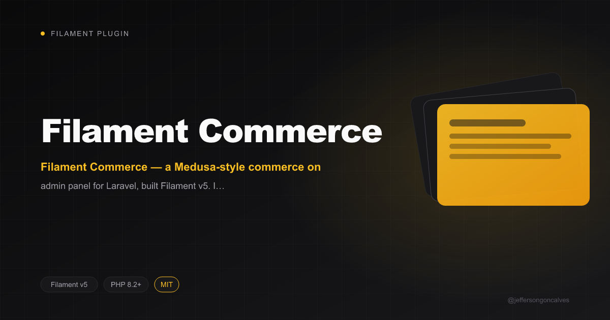

<p align="center"></p>

# Filament Commerce

[](https://packagist.org/packages/jeffersongoncalves/filament-commerce) [](https://packagist.org/packages/jeffersongoncalves/filament-commerce) [](LICENSE.md)

Filament Commerce — a Medusa-style commerce admin panel for Laravel, built on Filament v5. Installs every commerce module plugin via the CommercePanelPlugin.

## Installation

```bash
composer require jeffersongoncalves/filament-commerce
```

## Usage

The plugin is auto-discovered. Register it on a Filament panel:

```php
use JeffersonGoncalves\\FilamentCommerce\\Umbrella\\CommercePanelPlugin;

public function panel(Panel $panel): Panel
{
    return $panel->plugin(CommercePanelPlugin::make());
}
```

## License

The MIT License (MIT). Please see [License File](LICENSE.md) for more information.
